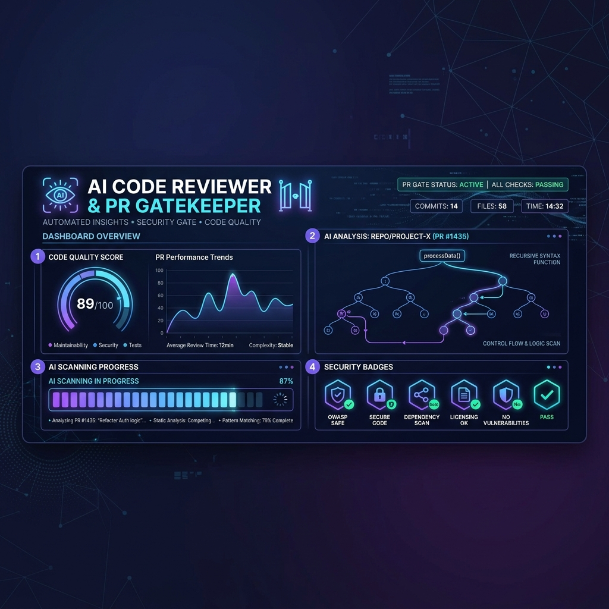
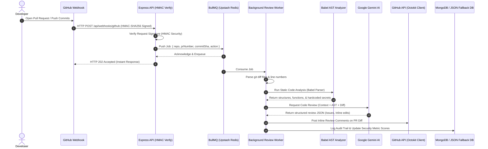

# Automated AI Code Reviewer & PR Gatekeeper 🤖🛡️



An enterprise-grade, developer-first CI/CD quality gatekeeper built on an **Event-Driven Architecture**. It integrates directly with GitHub repositories via webhooks to automatically parse, analyze, and review Pull Requests using Artificial Intelligence before code is merged. 

This application serves as a robust **PR Gatekeeper**—scanning incoming code changes for security vulnerabilities, performance bottlenecks, hardcoded secrets, and structural code smells, and posting line-specific inline reviews directly back to the pull request.

---

## 🏷️ Tech Stack & Badges

[](https://react.dev)
[](https://nodejs.org)
[](https://babeljs.io)
[](https://deepmind.google/technologies/gemini/)
[](https://upstash.com)
[](https://www.mongodb.com)
[](https://github.com)

----

## 🏗️ System Architecture & Workflow

The gatekeeper runs a decoupled background processing chain to keep request latencies low. Here is how code changes travel from your local IDE to a fully reviewed Pull Request:



---

## ✨ Core Features

*   🔑 **Secure OAuth & Webhook Verification:** Fully integrated with **GitHub OAuth 2.0** for secure user login. Incoming webhooks are cryptographically validated using a shared webhook secret and HMAC-SHA256 headers.
*   ⚡ **Robust Task Queuing:** Built with **BullMQ** running on a secure cloud **Upstash Redis** TLS instance, isolating slow LLM requests from the core webhook reception endpoint.
*   🔍 **Dual-Engine Code Review:**
    *   **Static AST Compiler Engine:** Parses JavaScript/JSX/TypeScript code into an Abstract Syntax Tree via `@babel/parser` to locate structural patterns (functions, classes, SQL injections, insecure `eval`, exposed keys).
    *   **Generative AI Review Engine:** Leverages Google's **Gemini Flash** LLM configured with structured response schemas (`responseSchema`) to review code logic, memory leaks, and anti-patterns, returning structured findings.
*   💾 **Resilient Fallback Design (Zero-Config Mode):** Works out-of-the-box! If cloud services like MongoDB Atlas or Redis are unavailable, the system automatically hot-swaps to a local JSON file-based database and an asynchronous in-memory queue processor.
*   📊 **Analytics Dashboard:** A rich, responsive UI dashboard built in React & Tailwind CSS featuring visual chart metrics (Recharts) displaying repository security scores, reviews counts, and issue logs.

---

## 🔍 Static AST Analyzer Engine Details

The compiler scanning engine inside [astAnalyzer.js](file:///Users/bhukyakairam/Desktop/projects/AI%20Code%20Reviewer%20&%20PR%20Gatekeeper/backend/src/utils/astAnalyzer.js) uses node-type visitors to evaluate security patterns on the AST representation before the code is sent to Gemini:
*   **VariableDeclarator & ObjectProperty:** Inspects keys for security tokens (`secret`, `token`, `privatekey`) and flags assignments containing high-entropy, hardcoded credentials.
*   **BinaryExpression (+):** Analyzes query concatenations looking for SQL keywords (`SELECT`, `INSERT`, `UPDATE`, `DELETE`) combined with variables to prevent SQL Injection attempts.
*   **CallExpression (eval):** Immediately flags the execution of dynamic strings via `eval()` as critical vulnerabilities.
*   **StringLiteral:** Scrapes code strings for hardcoded protocol paths like `mongodb://`, `postgres://`, or `mysql://`.

---

## 🛠 Skills & Engineering Competencies Demonstrated

*   **Compiler & Static Code Analysis:** Designing and traversing AST structural nodes to build contextual models of codebases.
*   **Event-Driven & Async Architecture:** Architecting background tasks using queue management libraries and Redis database connections.
*   **Cryptographic Security Practices:** Enforcing HMAC-SHA256 signature verifications and handling secure third-party credentials.
*   **Reliability Engineering:** Creating decoupled fallback interfaces (database adapters, memory queues) to guarantee high system availability during cloud database outages.

---

## 🗺 Directory Architecture

```text
├── backend/
│   ├── src/
│   │   ├── config/         # Database drivers, OAuth configuration, and Local JSON Database fallback
│   │   ├── controllers/    # Express controllers (auth, repos, webhooks, audit logs)
│   │   ├── middleware/     # GitHub signature checking and JWT token verification
│   │   ├── models/         # Database models (User, Repo, Review, AuditLog, Notification)
│   │   ├── routes/         # Express routing definitions
│   │   ├── services/       
│   │   │   ├── ai/         # Google Gemini AI connection and structured prompt settings
│   │   │   ├── github/     # Octokit integration for PR check runs and comments
│   │   │   ├── queue/      # Queue definitions & in-memory queue fallback handlers
│   │   │   └── workers/    # Background queue review processors
│   │   └── utils/          
│   │       ├── astAnalyzer.js  # AST Analysis parsing engine
│   │       ├── diffParser.js   # Git patch parser
│   │       └── scoringEngine.js# Weighted scoring model for repository health
│   │   └── server.js       # Entry point Express API Server
│   └── test-review.js      # Local sandbox integration tests
│
├── frontend/
│   ├── src/
│   │   ├── contexts/       # Authentication context hooks
│   │   ├── layouts/        # Dashboard layout wrapper containing brand copyright footer
│   │   ├── pages/          # Pages (Dashboard, Repositories, PRReviews, AuditLogs)
│   │   └── services/       # Axios API client setup
│   └── index.html          # Frontend root index
```

---

## ⚙️ Configuration (Environment Variables)

Create a `.env` file in the `backend/` directory:
```ini
PORT=5001
JWT_SECRET=your_jwt_secret_key_here
FRONTEND_URL=http://localhost:5173

# Databases (Leave blank to use local fallback JSON database and in-memory queue)
MONGODB_URI=
REDIS_URL=

# GitHub Settings
GITHUB_CLIENT_ID=your_github_client_id
GITHUB_CLIENT_SECRET=your_github_client_secret
GITHUB_WEBHOOK_SECRET=your_webhook_secret

# Gemini Settings
GEMINI_API_KEY=your_gemini_api_key
```

Create a `.env` file in the `frontend/` directory:
```ini
VITE_API_URL=http://localhost:5001
VITE_GITHUB_CLIENT_ID=your_github_client_id
```

---

## 💻 Local Development

### 1. Run the Backend Server
```bash
cd backend
npm install
npm run dev
```

### 2. Run the Frontend Dashboard
```bash
cd frontend
npm install
npm run dev
```
Open [http://localhost:5173](http://localhost:5173) in your browser.

---

## 🧪 Integration Sandbox Testing

To verify the parser pipeline, the Babel AST engine, local databases, and Gemini code recommendations without setting up actual live GitHub webhooks, run the sandbox test suite:
```bash
cd backend
node test-review.js
```

**The Sandbox Test Executes:**
1. Generates a mock pull request webhook event targeting mock JavaScript files.
2. Directs the event into the queue.
3. Automatically triggers static AST analysis via `@babel/parser` inside [astAnalyzer.js](file:///Users/bhukyakairam/Desktop/projects/AI%20Code%20Reviewer%20&%20PR%20Gatekeeper/backend/src/utils/astAnalyzer.js).
4. Generates an AI-driven security audit via Gemini.
5. Saves logs to the fallback DB and calculates the code security rating.

---

## 🚀 Production Deployment Setup

### 1. Render (Backend)
Deploy the `backend` folder as a Web Service on Render and set the following environment variables:
- `PORT`: `5001`
- `JWT_SECRET`: `your_jwt_signing_key`
- `FRONTEND_URL`: `https://your-frontend-domain.vercel.app` (your deployed Vercel domain)
- `MONGODB_URI`: `your_mongodb_atlas_connection_string`
- `REDIS_URL`: `your_redis_connection_url`
- `GITHUB_CLIENT_ID`: `your_github_oauth_client_id`
- `GITHUB_CLIENT_SECRET`: `your_github_oauth_client_secret`
- `GITHUB_CALLBACK_URL`: `https://your-backend-domain.onrender.com/api/auth/github/callback`
- `GITHUB_WEBHOOK_SECRET`: `your_github_webhook_signing_secret`
- `GEMINI_API_KEY`: `your_google_gemini_api_key`

### 2. Vercel (Frontend)
Deploy the `frontend` folder to Vercel and set the following environment variable:
- `VITE_API_URL`: `https://your-backend-domain.onrender.com/api`

### 3. GitHub OAuth Settings
Ensure your GitHub Developer settings for the OAuth Application has:
- **Homepage URL**: `https://your-frontend-domain.vercel.app`
- **Authorization callback URL**: `https://your-backend-domain.onrender.com/api/auth/github/callback`

---

<p align="center">
  <b>© 2026 AI Code Reviewer & PR gatekeeper All rights reserved.</b><br>
  <i>DESIGNED BY BHUKYA KAIRAM</i>
</p>
